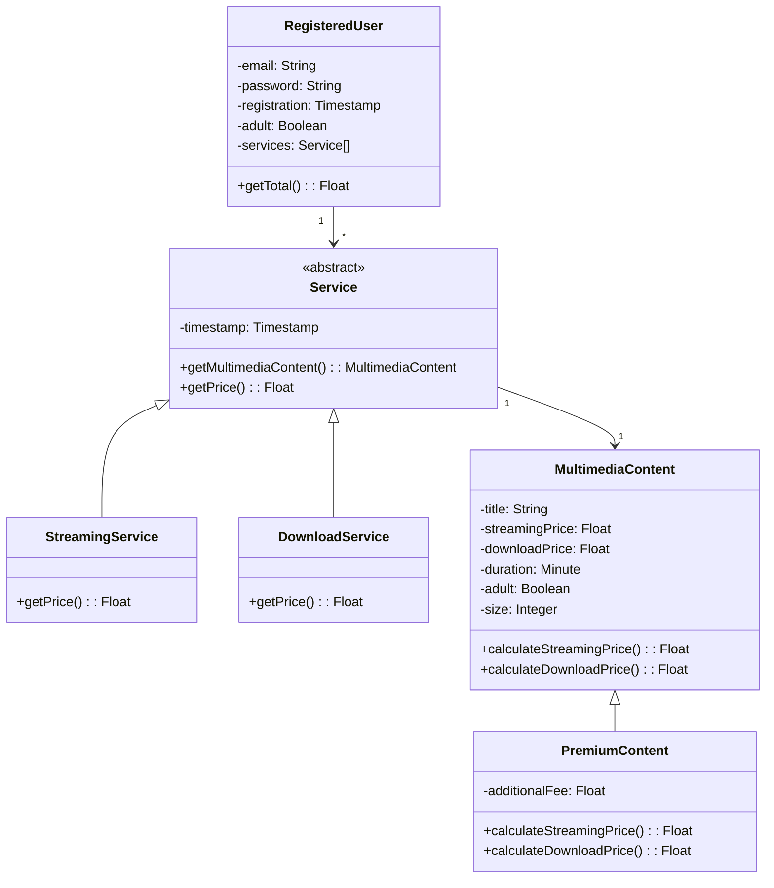

# Exercici 1 - Refactorització del Sistema de Preus

## 1. Problemes detectats a l'operació original

El principal problema és que el mètode `getTotal()` fa servir `typeof` per comprovar el tipus de cada servei i contingut. Això vol dir que cada vegada que afegim un nou tipus de servei (per exemple, un servei de lloguer o subscripció), hauríem de modificar aquest mètode i afegir més condicions. Això fa que el codi sigui fràgil i difícil de mantenir.

A més, la classe `RegisteredUser` té massa responsabilitat - ha de conèixer tots els tipus de serveis i continguts que existeixen, i això crea un acoblament molt fort entre les classes.

També hi ha codi duplicat: el càlcul de la tarifa addicional del contingut premium es repeteix en els dos casos (streaming i descàrrega).

## 2. Solució proposada

La meva solució és delegar la responsabilitat del càlcul del preu a cada classe. Cada tipus de servei sap com calcular el seu preu, i cada tipus de contingut sap com calcular el seu preu d'streaming i descàrrega.

Amb aquest canvi, el mètode `getTotal()` de `RegisteredUser` es simplifica molt: només ha de demanar a cada servei el seu preu i sumar-los. No necessita saber quin tipus de servei és ni com es calcula el preu.

Això fa que el codi sigui més fàcil d'estendre: si en el futur volem afegir nous tipus de serveis, només cal crear una nova classe que hereti de `Service` i implementi el mètode `getPrice()`. No cal tocar la classe `RegisteredUser`.

### Diagrama de classes actualitzat



### Pseudocodi refactoritzat

```javascript
class MultimediaContent {
    calculateStreamingPrice() {
        return this.streamingPrice;
    }
    
    calculateDownloadPrice() {
        return this.downloadPrice;
    }
}

class PremiumContent extends MultimediaContent {
    calculateStreamingPrice() {
        return this.streamingPrice + this.additionalFee;
    }
    
    calculateDownloadPrice() {
        return this.downloadPrice + this.additionalFee;
    }
}

class Service {
    getPrice() {
        // Abstract method - implemented by subclasses
    }
}

class StreamingService extends Service {
    getPrice() {
        let multimediaContent = this.getMultimediaContent();
        return multimediaContent.calculateStreamingPrice();
    }
}

class DownloadService extends Service {
    getPrice() {
        let multimediaContent = this.getMultimediaContent();
        return multimediaContent.calculateDownloadPrice();
    }
}

class RegisteredUser {
    constructor(services = []) {
        this.services = services;
    }
    
    getTotal() {
        let total = 0;
        
        this.services.forEach(service => {
            total += service.getPrice();
        });
        
        return total;
    }
}
```
# Exercici 2 - React Meetup Clone

To start the project, in the project directory, you can run:
### `npm install`
### `npm start`

Runs the app in the development mode.\
Open [http://localhost:3000](http://localhost:3000) to view it in your browser.

The page will reload when you make changes.\
You may also see any lint errors in the console.

### `npm test`

Launches the test runner in the interactive watch mode.\
See the section about [running tests](https://facebook.github.io/create-react-app/docs/running-tests) for more information.

### `npx playwright test`
or
### `npx playwright test --debug`
### `npx playwright test --headed`

Launches the e2e tests, using the flags shows browser/enables debugging mode.

